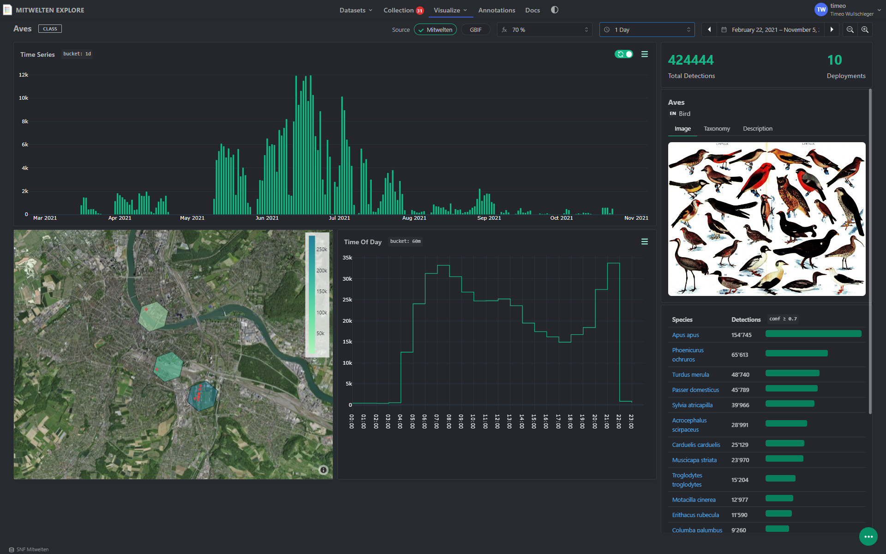
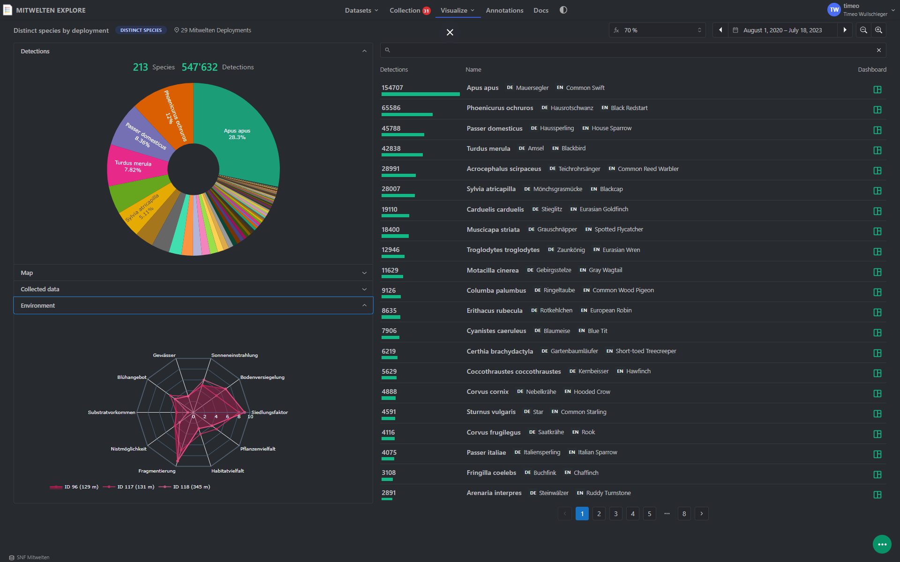
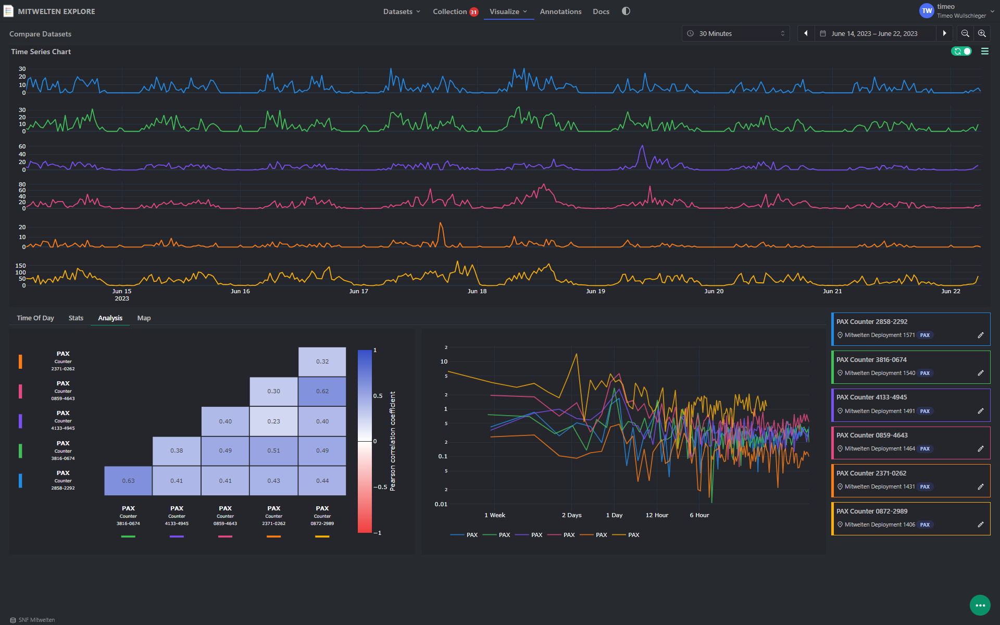
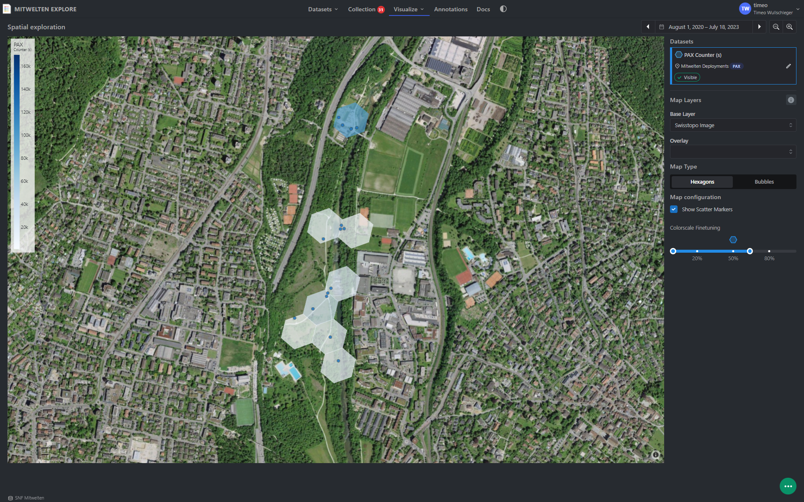
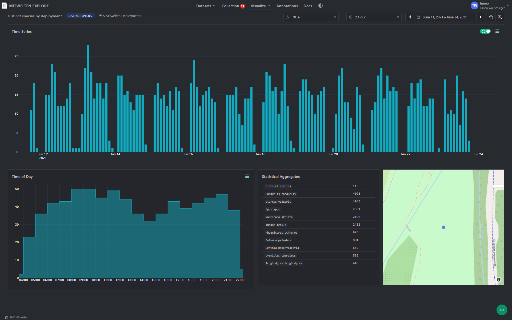

# Mitwelten Explore 
Visual Exploration for Urban Biodiversity Monitoring

**[explore.mitwelten.org](https://explore.mitwelten.org)**


Mitwelten Explore is an application for exploring biodiversity in and around Basel.

## Dashboards


### Species Dashboard 🦅
Explore the spatial and temporal activity of more than 200 detected species


### Habitat-specific biodiversity 🌲
Discover the ontodiversity in specific places


### Compare different datasets 🔬
Find the factors that influence biodiversity


### Analyze spatial activities 🗺
Analyze spatial differences and find out where you could spot certain species


### Spot trends over time 📅
Learn about the seasonal and daily changes in biodiversity



## Deployment

### 1. Build docker image

```sh
git clone https://github.com/mitwelten/mitwelten-explore.git
cd mitwelten-explore/mitwelten_explore
docker build  -t cr.gitlab.fhnw.ch/mitwelten/docker-infrastructure/mitwelten-explore:0.1 .
```

### 2. Push the image to the registry (optional)

```sh
docker push cr.gitlab.fhnw.ch/mitwelten/docker-infrastructure/mitwelten-explore:0.1
docker push cr.gitlab.fhnw.ch/mitwelten/docker-infrastructure/mitwelten-explore:latest
```
### 3. Run the container
```sh
docker run --rm -d -p 8081:80 \
    --env KC_SERVER_URL=https://auth.mitwelten.org/auth/ \
    --env KC_CLIENT_ID=explore \
    --env KC_REALM_NAME=mitwelten \
    --env DOMAIN_NAME=http://localhost:8081 \
    #--env REDIS_HOST=redis_cache \
    #--env REDIS_PORT=6379 \
    cr.gitlab.fhnw.ch/mitwelten/docker-infrastructure/mitwelten-explore:latest
```

Environment variables
name|required|description
-|-|-
KC_SERVER_URL|yes|Keycloak url
KC_CLIENT_ID|yes|Keycloak client id
KC_REALM_NAME|yes|Keycloak realm name
DOMAIN_NAME|yes|domain name for the `mitwelten-explore` app
REDIS_HOST|no|host of a redis instance for caching requests
REDIS_PORT|no|port of a redis database


### 4. Run in docker compose

Minimal example
```yaml
version: '3.3'

services:
  mitwelten-explore:
    image: cr.gitlab.fhnw.ch/mitwelten/docker-infrastructure/mitwelten-explore:latest
    restart: always
    container_name: mitwelten-explore
    environment:
      - KC_SERVER_URL=https://auth.mitwelten.org/auth/
      - KC_CLIENT_ID=explore
      - KC_REALM_NAME=mitwelten
      - DOMAIN_NAME=https://explore.mitwelten.org
    labels:
      - "traefik.enable=true"
      - "traefik.http.services.mwexplore.loadbalancer.server.port=80"

      # for http
      - "traefik.http.routers.mwexplore_insecure.rule=Host(`explore.mitwelten.org`)"
      - "traefik.http.routers.mwexplore_insecure.entrypoints=http"

      # redirect to https
      - "traefik.http.middlewares.mwexplore-https.redirectscheme.scheme=https"
      - "traefik.http.routers.mwexplore_insecure.middlewares=mwexplore-https"

      # for https
      - "traefik.http.routers.mwexplore.rule=Host(`explore.mitwelten.org`)"
      - "traefik.http.routers.mwexplore.entrypoints=https"
      - "traefik.http.routers.mwexplore.tls.certresolver=ssl"
```

With redis, keycloak and traefik
```yaml
version: '3.3'

services:
  traefik:
    image: "traefik:v2.8.8"
    container_name: "traefik"
    command:
      - "--log.level=INFO"
      - "--api.insecure=true"
      - "--providers.docker=true"
      - "--providers.docker.exposedbydefault=false"
      - "--entrypoints.http.address=:80"
      - "--entrypoints.https.address=:443"
      - "--certificatesresolvers.ssl.acme.tlschallenge=true"
      - "--certificatesresolvers.ssl.acme.email=your-email@example.ch"
      - "--certificatesresolvers.ssl.acme.storage=/letsencrypt/acme.json"
      - "--providers.file.watch=true"
    ports:
      - "80:80"
      - "443:443"
    volumes:
      - "/etc/letsencrypt:/letsencrypt"
      - "/var/run/docker.sock:/var/run/docker.sock:ro"
    restart: always

  keycloak:
    container_name: keycloak
    image: quay.io/keycloak/keycloak:legacy
    restart: unless-stopped
    environment:
      KEYCLOAK_USER: ${KC_USERNAME}
      KEYCLOAK_PASSWORD: ${KC_PASSWORD}
      DB_VENDOR: POSTGRES
      DB_ADDR: ${KC_DB_HOST}
      DB_DATABASE: ${KC_DATABASE}
      DB_USER: ${KC_DB_USERNAME}
      DB_PASSWORD: ${KC_DB_PASSWORD}
      DB_SCHEMA: ${KC_DB_SCHEMA}
      PROXY_ADDRESS_FORWARDING: "true"
    labels:
      - "traefik.enable=true"
      - "traefik.http.services.kc.loadbalancer.server.port=8080"
      # for http
      - "traefik.http.routers.kc_insecure.rule=Host(`auth.yourdomain.org`)"
      - "traefik.http.routers.kc_insecure.entrypoints=http"

      # redirect to https
      - "traefik.http.middlewares.kc-https.redirectscheme.scheme=https"
      - "traefik.http.routers.kc_insecure.middlewares=kc-https"

      # for https
      - "traefik.http.routers.kc.rule=Host(`auth.yourdomain.org`)"
      - "traefik.http.routers.kc.entrypoints=https"
      - "traefik.http.routers.kc.tls.certresolver=ssl"

  mitwelten-explore:
    image: cr.gitlab.fhnw.ch/mitwelten/docker-infrastructure/mitwelten-explore:latest
    restart: always
    container_name: mitwelten-explore
    environment:
      - KC_SERVER_URL=https://auth.yourdomain.org/auth/
      - KC_CLIENT_ID=explore
      - KC_REALM_NAME=mitwelten
      - DOMAIN_NAME=https://explore.yourdomain.org
      - REDIS_HOST=redis_cache
      - REDIS_PORT=6379
    labels:
      - "traefik.enable=true"
      - "traefik.http.services.mwexplore.loadbalancer.server.port=80"

      # for http
      - "traefik.http.routers.mwexplore_insecure.rule=Host(`explore.yourdomain.org`)"
      - "traefik.http.routers.mwexplore_insecure.entrypoints=http"

      # redirect to https
      - "traefik.http.middlewares.mwexplore-https.redirectscheme.scheme=https"
      - "traefik.http.routers.mwexplore_insecure.middlewares=mwexplore-https"

      # for https
      - "traefik.http.routers.mwexplore.rule=Host(`explore.yourdomain.org`)"
      - "traefik.http.routers.mwexplore.entrypoints=https"
      - "traefik.http.routers.mwexplore.tls.certresolver=ssl"

  redis_cache:
    image: redis
    container_name: redis_cache
    restart: always
```